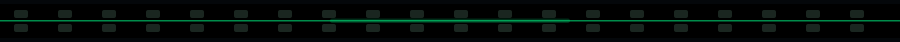

<div align="center">




[](https://dev-roba.github.io)
[](https://www.linkedin.com/in/robert-wachira-9b8227393/)
[](https://hackerone.com/dev-roba)
[](mailto:wachirarobert940@gmail.com)

</div>



## `▶ now_playing.mkv`

<div align="center">

<table><tr><td width="50%">



</td><td width="50%">



</td></tr></table>

</div>

```console
$ cat mission.txt
explore the edge cases of security & design —
then ship things that are unbreakable AND beautiful.
```

## `▶ units_of_love.mp4`

| 🛡️ cybersecurity | 🎨 web design | 🧠 ai / ml |
|---|---|---|
| pentest · forensics · osint | motion-first interfaces · design systems | anomaly detection · llm safety |

| ⚙️ systems | 📊 data science | 🌍 open source |
|---|---|---|
| c · rust · linux internals | logs → narratives | mentoring african devs |

## `▶ the_stack.mp4`

<div align="center">


</div>


## `▶ transmission_stats.mp4`

<div align="center">
<picture>
  <source media="(prefers-color-scheme: dark)" srcset="https://github-readme-stats.vercel.app/api?username=dev-roba&show_icons=true&hide_border=true&bg_color=00000000&title_color=00ff88&icon_color=22d3ee&text_color=d7e4dc&ring_color=00ff88" />
  
</picture>
<picture>
  <source media="(prefers-color-scheme: dark)" srcset="https://streak-stats.demolab.com?user=dev-roba&hide_border=true&background=00000000&stroke=00ff8833&ring=00ff88&fire=ff2d78&currStreakNum=d7e4dc&sideNums=d7e4dc&currStreakLabel=00ff88&sideLabels=7d8f88&dates=5c6d66" />
  
</picture>
<br/>
<picture>
  <source media="(prefers-color-scheme: dark)" srcset="https://github-readme-stats.vercel.app/api/top-langs/?username=dev-roba&layout=compact&hide_border=true&bg_color=00000000&title_color=00ff88&text_color=d7e4dc" />
  
</picture>
</div>

## `▶ the_grass_eats.mp4`

<div align="center">
<picture>
  <source media="(prefers-color-scheme: dark)" srcset="https://raw.githubusercontent.com/dev-roba/dev-roba/output/snake-dark.svg" />
  <source media="(prefers-color-scheme: light)" srcset="https://raw.githubusercontent.com/dev-roba/dev-roba/output/snake-light.svg" />
  
</picture>
</div>


<div align="center">

```console
// credits roll...
// directed by  → curiosity
// produced by  → caffeine
// filmed on    → dev-roba.github.io
```


**© 2026 RW://WAMBUGU — END OF TRANSMISSION** `▊`

</div>
